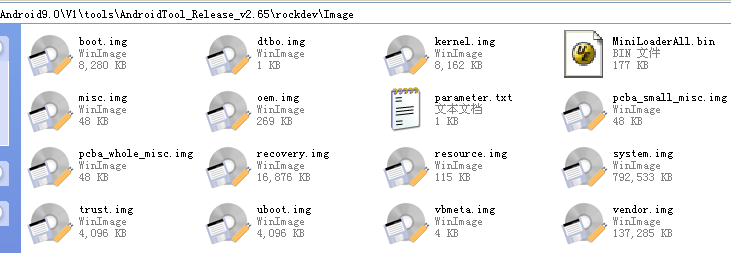
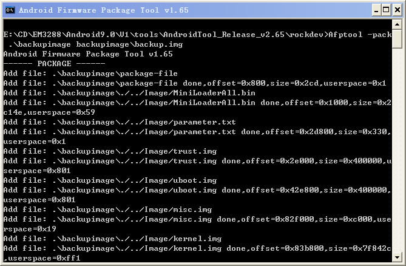
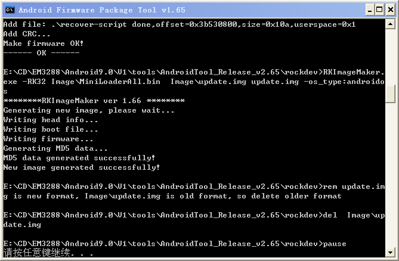
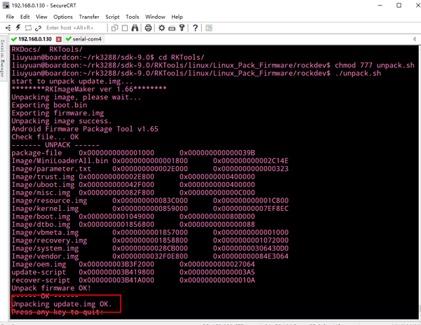
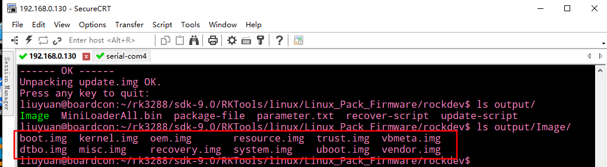
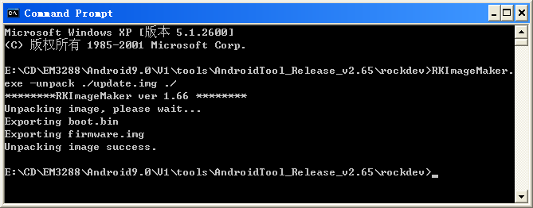
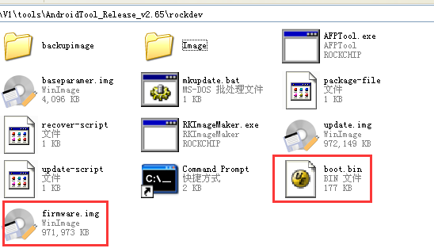
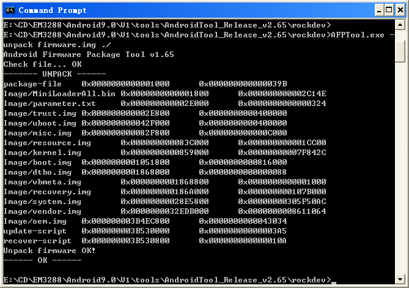
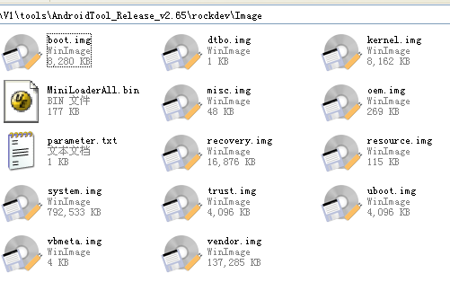

Android9
=========

1 Compile Source 
-----------------

Step 1, unzip the source.

.. code-block::

  tar zxvf EM3288_android_9.0.tar.bz2

Step 2, compile uboot

.. code-block::

   cd sdk-9.0/uboot
   make clean
   make mrproper
   ./make.sh rk3288

Step 3, compile the kernel

.. code-block::

   cd sdk-9.0/kernel
   make ARCH=arm rockchip_defconfig
   make ARCH=arm rk3288-evb-android-act8846-lvds-avb.img -j8

**kernel.img**, **resource.img** and **boot.img** are generated in current directory.

Step 4, compile the android

.. code-block::

   cd sdk-9.0
   source build/envsetup.sh
   lunch                      # Choose rk3288-userdebug
   make -j8

Step 5, Generated image file

.. code-block::

   ./mkimage.sh
   cd rockdev/Image-rk3288
   ls

Images are generated in current directory.

2 Images Operation
-----------------

2.1 Pack Image
^^^^^^^^^^^^^^

Step 1, copy all the files in Android directory :file:`rockdev/Image` to the windows :file:`AndroidTool_Release_v2.65/rockdev/Imag`

Step 2, enter :file:`AndroidTool_Release_v2.65/rockdev/`, double-click to run **mkupdate.bat.**

Step 3, the **update.img** will be generated in **rockdev** directory.

.. image:: image/EM3288_Android9_4.png

2.2 Unzip Firmware
^^^^^^^^^^^^^^^^^^^

For alternative ways to Unzip Firmwarec, see below for your operating system.

.. raw:: html

     Ubuntu 

Step 1, copy **update.img** to the android source directory :file:`RKTools/linux/Linux_Pack_Firmware/rockdev/`

Step 2, execute the following command

.. code-block::

   cd RKTools/linux/Linux_Pack_Firmware/rockdev/
   chmod 777 unpack.sh
   ./unpack.sh
   ls output/
   ls output/Image/

The unzip files will be generated in **output** directory.

.. centered::
    Windows

Step 1, copy **update.img** to the windows directory :file:`AndroidTool_Release_v2.65/rockdev/`

Step 2, open Command Prompt then execute the following command in CMD

.. code-block::

  RKImageMaker.exe -unpack ./update.img ./

After unzip the file to get boot.bin and firmware.img

Step 3, execute the following command in CMD to unzip **firmware.img**

.. code-block::

   AFPTool.exe -unpack firmware.img ./

The unzip files will be generated in :file:`AndroidTool_Release_v2.65\rockdev\Image`

