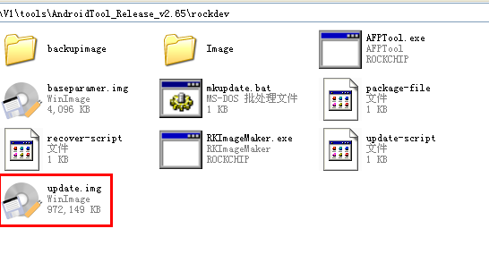
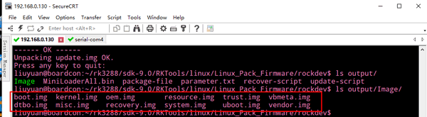
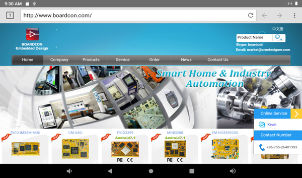
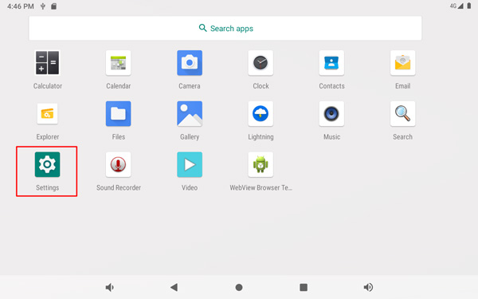

Android 9
=========

1 Compiler Environment
---------------------

1.1 Vmware10.0 + ubuntu16.04
^^^^^^^^^^^^^^^^^^^^^^^^^^^^^^

Install Vmware10.0 in Windows OS, and then install ubuntu16.04 in VMware
to compile. Please visit the official website http://www.ubuntu.com/ to
download and install ubuntu operating system.

.. Note::

 Android9 should be complied by ubuntu 64bit OS.

1.2 Install OpenJDK1.8
^^^^^^^^^^^^^^^^^^^^^^^^^

.. code-block::

  sudo mkdir /usr/lib/java
  sudo tar zxvf java-8-openjdk-amd64.tar.gz –C /usr/lib/java/

Add the following information in the end of **/etc/profile**

| export JAVA_HOME=/usr/lib/java/java-8-openjdk-amd64
| export JRE_HOME=/usr/lib/java/java-8-openjdk-amd64/jre
| export CLASSPATH=.:$JAVA_HOME/lib:$JRE_HOME/jre/lib:$CLASSPATH
| export PATH=$JAVA_HOME/bin:$JRE_HOME/jre/bin:$PATH

.. code-block::

  source /etc/profile

Check JDK version
  
.. code-block::

   java -version

1.3 Install Tools
^^^^^^^^^^^^^^^^^^^^^

- PC OS: ubuntu system
- Network: online
- Permission: root

.. code-block::

  sudo apt-get install build-essential
  sudo apt-get install zlib1g-dev
  sudo apt-get install flex
  sudo apt-get install libx11-dev
  sudo apt-get install gperf
  sudo apt-get install libncurses5-dev
  sudo apt-get install bison
  sudo apt-get install lsb-core
  sudo apt-get install lib32z1-dev
  sudo apt-get install g++-multilib
  sudo apt-get install lib32ncurses5-dev
  sudo apt-get install uboot-mkimage
  sudo apt-get install g++-4.4-multilib

2 Compile Source 
-----------------

Step 1, unzip the source.

.. code-block::

  tar zxvf EM3288_android_9.0.tar.bz2

Step 2, compile uboot

.. code-block::

   cd sdk-9.0/uboot
   make clean
   make mrproper
   ./make.sh rk3288

Step 3, compile the kernel

.. code-block::

   cd sdk-9.0/kernel
   make ARCH=arm rockchip_defconfig
   make ARCH=arm rk3288-evb-android-act8846-lvds-avb.img -j8

**kernel.img**, **resource.img** and **boot.img** are generated in current directory.

Step 4, compile the android

.. code-block::

   cd sdk-9.0
   source build/envsetup.sh
   lunch                      # Choose rk3288-userdebug
   make -j8

Step 5, Generated image file

.. code-block::

   ./mkimage.sh
   cd rockdev/Image-rk3288
   ls

Images are generated in current directory.

3 Images Operation
-----------------

3.1 Pack Image
^^^^^^^^^^^^^^

Step 1, copy all the files in Android directory :file:`rockdev/Image` to the windows :file:`AndroidTool_Release_v2.65/rockdev/Imag`

Step 2, enter :file:`AndroidTool_Release_v2.65/rockdev/`, double-click to run **mkupdate.bat.**

Step 3, the **update.img** will be generated in **rockdev** directory.

.. image:: ./image/EM3288_Android9_2.png

.. image:: image/EM3288_Android9_3.png

3.2 Unzip Firmware
^^^^^^^^^^^^^^^^^^^

For alternative ways to Unzip Firmware, see below for your operating system.

.. raw:: html

 
<strong>Ubuntu OS</strong>

    
Step 1, copy **update.img** to the android source directory :file:`RKTools/linux/Linux_Pack_Firmware/rockdev/`

Step 2, execute the following command

.. code-block::

   cd RKTools/linux/Linux_Pack_Firmware/rockdev/
   chmod 777 unpack.sh
   ./unpack.sh
   ls output/
   ls output/Image/

.. image:: image/EM3288_Android9_5.png

The unzip files will be generated in **output** directory.

.. raw:: html

 
<strong> Windows OS </strong>

Step 1, copy **update.img** to the windows directory :file:`AndroidTool_Release_v2.65/rockdev/`

Step 2, open Command Prompt then execute the following command in CMD

.. code-block::

  RKImageMaker.exe -unpack ./update.img ./

.. image:: image/EM3288_Android9_7.png

After unzip the file to get boot.bin and firmware.img

.. image:: image/EM3288_Android9_8.png

Step 3, execute the following command in CMD to unzip **firmware.img**

.. code-block::

   AFPTool.exe -unpack firmware.img ./

.. image:: image/EM3288_Android9_9.png

The unzip files will be generated in :file:`AndroidTool_Release_v2.65\rockdev\Image`

.. image:: image/EM3288_Android9_10.png

4 Burn Images
-------------

Step 1, unzip **AndroidTool_Release_v2.65** on Windows.

Step 2, open :file:`AndroidTool_Release_v2.65\AndroidTool.exe`

Step 3, keep pressing the **Recover Key,** then connect PC and development board with Micro USB cable until the PC Window shows
**Found one LOADER Device**

.. tips::
 The USB power supply is only available for programming, and the current is not enough for the board to run.

Step 4, click *Upgrade Firmware  ->  Firmware*, select
**update.img**. Click *Upgrade* to flash.

Download complete.

User can also update the firmware separately.

Step 1, Click the column on the right side for the path of the file want to flash.

Step 2, Select the checkbox on the left.

Step 3, Click *Run* to flash the image.

5 Android Application
----------------------

5.1 HDMI Display
^^^^^^^^^^^^^^^^^

Connect the board and monitor with a HDMI cable, then start up.

5.2 SD Card
^^^^^^^^^^^^^^^^^

EM3288 supports SD Hot-plug.

5.3 USB Host
^^^^^^^^^^^^^^^^^

The USB Host can be used to connect USB mouse, USB keyboard, U-Disk or other USB devices.

5.4 Video Player
^^^^^^^^^^^^^^^^^

Open **Video** and select file to play.

5.5 Ethernet
^^^^^^^^^^^^^^^^^

Connect the Board and router with an Ethernet cable (default DHCP=Yes). User can ping URL/IP at terminal, or open the browser to test Network.

.. code-block::
   su
   ping www.boardcon.com

5.6 Record
^^^^^^^^^^^^

Step 1, open the APP Recorder in Android.

Step 2, click on the APP to start recording, speech in front of the microphone then can record.

.. Note::
 
  Default microphone recording. It will switch to the headset recording automatically if inserted the headset .

After finish recording, click *Stop* menu and select **Save** to store file.

The default storage path is :file:`Internal Memory/Records`

.. image:: image/EM3288_Android9_39.jpg

5.7 RTC
^^^^^^^^

Execute the command **hwclock** at CRT terminal

.. code-block::

  hwclock

Wait a moment then run **hwclock** again, it can be seen the time has changed.

5.8 WiFi
^^^^^^^^^^^^^^^^^

Connect the WiFi antenna, then click *Settings -> Network&internet -> WiFi -> turn on*, select the SSID from the list of available networks and enter the password.

After connected, user can open the browser to browse the web.

5.9 Bluetooth
^^^^^^^^^^^^^^^^^
Click *Settings -> Connected devices(Bluetooth) -> Connection preferences -> Bluetooth -> turn on*, Select the available device in the list to pair.

After pairing, devices can connect with each other automatically

5.10 4G Network
^^^^^^^^^^^^^^^^^

Step 1, Insert 4G module to PCI-E slot (4G model:EC20).

Step 2, Connect antenna and insert SIM card.

Step 3, The default connection is 4G network after power on.

4G network settings:

*Settings -> Networks & internet -> Mobile network -> Preferred network type -> 4G*

5.11 GPS
^^^^^^^^^

Connect GPS antenna, then power on and install the APP
**GPS_test1.2.4.apk** path: :file:`CD/Tools/`

.. image:: image/EM3288_Android9_50.jpg

5.12 Camera
^^^^^^^^^^^^^

Connect the camera module (OV13850) to the development board **before power on**, then click the camera app to test.

5.13 SATA
^^^^^^^^^^^^^^^^^

EM3288 not support sata Hot-plug. Connect the sata module to the development board **before power on**，then the sata will auto mount.

The current supplied by the development board is not enough to maintain the stable operation of SATA, it is recommended to provide an external power supply for SATA.

