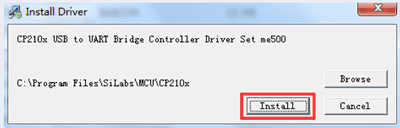
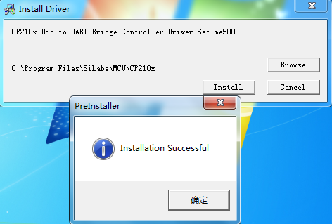
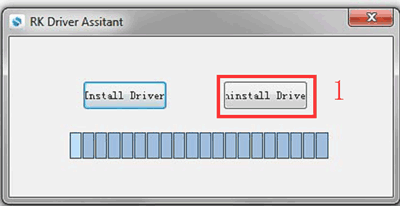
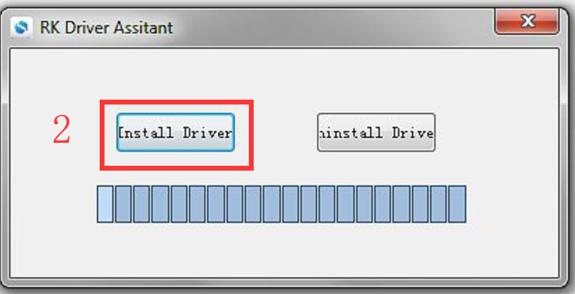
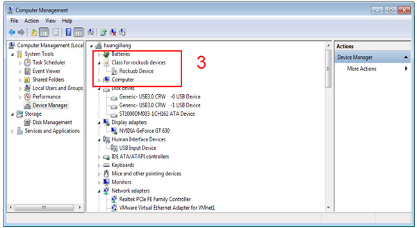
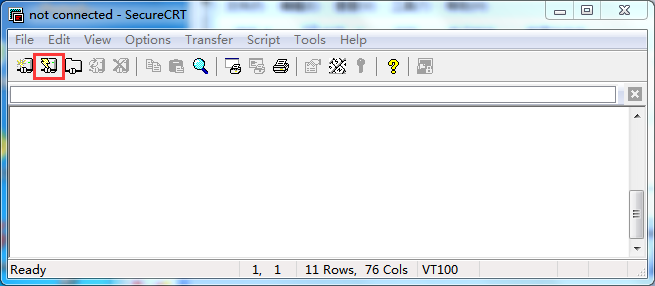
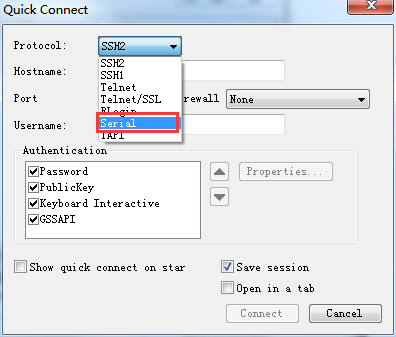
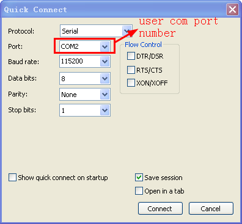
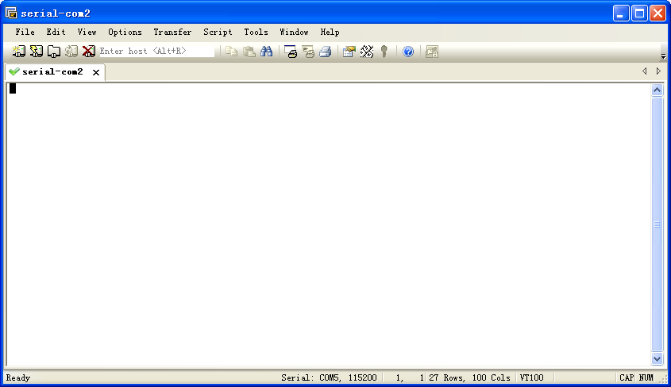

Install Debug Tools
====================

1 Install CP2102 Driver  
-----------------------

Plug the USB-to-UART cable CP2102 to the PC, unzip **CP2102WIN7.rar** on Windows, then click **preInstaller.exe** to install

      
Now the device will be listed under *Device Manager -> PORTS* with unique serial port assigned

2 Install Rockchip Driver Assistant
-------------------------------------

Path :file:`Release_DriverAssitant/DriverInstall.exe`

   

After the installation is complete,connect the board and PC with Micro USB cable (USB powered), in *Computer Management* can see the following information:

3 Install Serial Terminal Tool
-------------------------------

The serial terminal **SecureCRT** is used for debugging. It can be used directly after decompression. 
Open **SecureCRT.exe** after copy to PC :file:`tools/windows/SecureCRT.exe`, then click the icon *Quick Connect* to config

Set the parameters as follow:

- Protocol: Serial
- Port: To be specified by user PC
- Baud rate: 115200
- Please check **XON/XOFF** but not **RTS/CTS**
- Check *Save* session

After all, click *connect*

 
.. note:: 

 If open more than one serial terminal tools, and they use the same serial port, there will be reported **the port is busy**.
 **Solution**: Turn off the serial tool that unnecessary.
