Introduction
==============

This document is based on EM3288 V7(MINI3288 version: V4).

1 EM3288 Introduction
-------------------

1.1 Summary
^^^^^^^^^^^^

| EM3288 is based on the Rockchip RK3288, Quad Core Cortex-A17 @1.8GHz.
  RK3288 is powerful on multithreaded computing operation, graphics
  processing and video decoding ability. RK3288 supports Mali-T760 MP4
  Graphics Processing, OpenGL ES1.1/2.0/3.0, OpenVG1.1, OpenCL,
  Directx11, and can 4Kx2K achieve 4kx2k H.264 and 10 bits of H.265
  video decoding, 500% performance boost over Mali-400. On display
  aspects, RK3288 supports up to 18Gbps Data transmission rate and
  4Kx2K@60Hz Video resolution.
| EM3288 is provided with full ready-to-run Android7.1.2 and Ubuntu SW
  packages and comprehensive user manual and designing guide.

1.2 Rockchip RK3288 Features
^^^^^^^^^^^^^^^^^^^^^^^^^^^^^^^^

-  CPU

Quad-Core Cortex-A17, up to 1.8GHz

-  GPU

Mali-T764 GPU, Supports AFBC (ARM Frame Buffer Compression)

 - Support OpenGL ES 1.1/2.0/3.1, OpenCL, DirectX9.3
 - High performance dedicated 2D processor

-  Multi-image

4K 10bits H265/H264 video decoders

 - 1080P other video decoders (VC-1, MPEG-1/2/4, VP8)
 - 1080P video encoder for H.264 and VP8
 - Video post processor: de-interlace, de-noise, enhancement for
   edge/detail/color

-  Display

Support RGB/Dual LVDS/Dual MIPI-DSI/eDP interface, up to 3840*2160 resolution
HDMI 2.0 for 4K@60Hz with HDCP 1.4/2.2

-  Security
ARM TrustZone (TEE), Secure Video Path, Cipher Engine, Secure boot

-  Memory

 - Dual-channel 64bit DDR3-1333/DDR3L-1333/LPDDR2-1066
 - Support MLC NAND, eMMC 4.51
 
-  Connectivity

 - Embedded 13M ISP, MIPI CSI-2 and DVP interface
 - Dual SDIO 3.0 interface
 - TS in/CSA2.0, support DTV function
 - Embed HDMI, Ethernet MAC, S/PDIF, USB, I2C, I2S, UART, SPI, PS2

1.3 EM3288 Specifications
^^^^^^^^^^^^^^^^^^^^^^^^^^^^

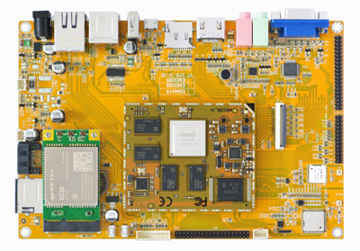
    
+---------------+------------------------------------------------------+
|   Feature     |   Specifications                                     |
+===============+======================================================+
| CPU           | · Rockchip RK3288, Quad Core Cortex-A17 @ 1.8GHz     |
|               | · 28nm HKMG process                                  |
+---------------+------------------------------------------------------+
| GPU           | · ARM Mali-T764 GPU, with TE, ASTC, AFBC technology  |
|               | · Support OpenGL ES1.1/2.0/3.0, OpenVG1.1, OpenCL,   |
|               | DirectX11                                            |
+---------------+------------------------------------------------------+
| Memory        | 512MB/1GB/2GB DDR3                                   |
+---------------+------------------------------------------------------+
| Storage       | – 4/8/16/32GB eMMC Flash                             |
|               |                                                      |
|               | – 1x SATA                                            |
|               |                                                      |
|               | – 1 x Micro SD                                       |
+---------------+------------------------------------------------------+
| Power Supply  | 5V/3A                                                |
+---------------+------------------------------------------------------+
| USB           | 3x USB2.0 Host, 1x USB2.0 OTG                        |
+---------------+------------------------------------------------------+
| Video I/O     | – HDMI 2.0 up to 3840×2160@60p                       |
|               |                                                      |
|               | – 40-pin header for LVDS (multiplexed with VGA)      |
|               |                                                      |
|               | | – VGA                                              |
|               | | – 40-pin FPC connector for TTL LCD                 |                                          
|               | – 26-pin header for MIPI Camera                      |
+---------------+------------------------------------------------------+
| Audio I/O     | – HDMI                                               |
|               |                                                      |
|               | – 3.5mm jacks for Audio out and Line in              |
|               |                                                      |
|               | – Differential MIC                                   |
|               |                                                      |
|               | ES8388 audio codec                                   |
+---------------+------------------------------------------------------+
| Debugging     | Serial console via 3-pin header                      |
+---------------+------------------------------------------------------+
| Connectivity  | – Gigabit Ethernet. RTL8211E-VB-CG controller        |
|               |                                                      |
|               | – Optional 802.11b/g/n and Bluetooth4.0              |
|               |                                                      |
|               | – Optional 4G Module (Built-in GPS) and SIM card slot|
|               | – Optional GPS model via SATES (HK) ST-91-U7         |
+---------------+------------------------------------------------------+
| Expansion     | 1x 40-pin header for GPIOs, ADC, I2C, etc.           |
| Headers       |                                                      |
+---------------+------------------------------------------------------+
| Misc          | RTC, power and recovery buttons                      |
+---------------+------------------------------------------------------+
| Dimension     | 117.5 x 175.3mm                                      |
+---------------+------------------------------------------------------+

1.4 PCB Dimension
^^^^^^^^^^^^^^^^^^^

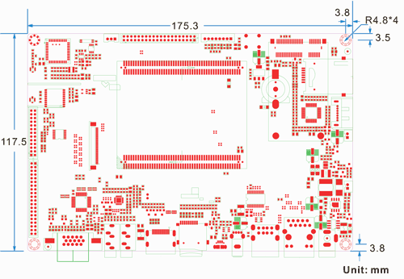
    
1.5 Block Diagram
^^^^^^^^^^^^^^^^^^^^

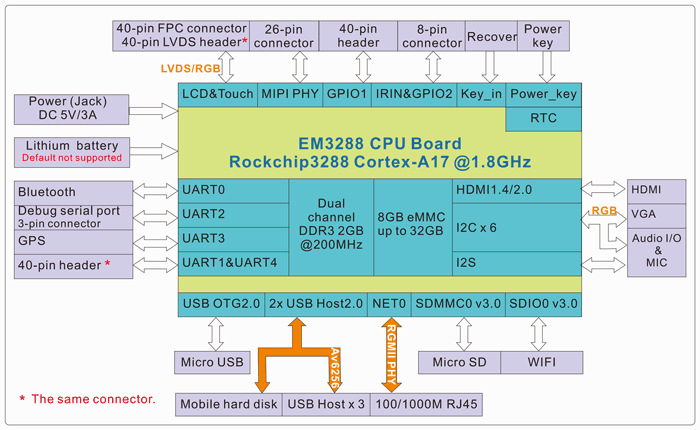
    
1.6 CPU Introduction 
^^^^^^^^^^^^^^^^^^^^^^

.. image:: image/image5.jpeg
   :alt: arm-MINI3288
    :align: center
    
**Board Dimension**

| \* Board size: 70mm x 58mm
| \* Pin to Pin space: 1.3mm
| \* Pin number: (J11+J12) x 100 = 200 pins
| \* Layer: 8 Layers, complying with EMS/EMI

.. image:: image/image6.png
     :align: center
    
**Pin Definition**

+---+-----------+----+-------------+----+-----------+----+----------+
| P | Signal    | P  | Signal      | P  | Signal    | P  | Signal   |
| i |           | in |             | in |           | in |          |
| n |           |    |             |    |           |    |          |
|   |           | (J |             | (J |           | (J |          |
| ( |           | 1) |             | 2) |           | 2) |          |
| J |           |    |             |    |           |    |          |
| 1 |           |    |             |    |           |    |          |
| ) |           |    |             |    |           |    |          |
+===+===========+====+=============+====+===========+====+==========+
| 1 | TX_C      | 51 | MIP         | 1  | VCC_SYS   | 51 | SPI0_U   |
|   |           |    | I_TX/RX_D2P |    |           |    | ART4_RXD |
+---+-----------+----+-------------+----+-----------+----+----------+
| 2 | TX_0-     | 52 | MIP         | 2  | GND       | 52 | SPI0_U   |
|   |           |    | I_TX/RX_D1P |    |           |    | ART4_TXD |
+---+-----------+----+-------------+----+-----------+----+----------+
| 3 | TX_C+     | 53 | MIP         | 3  | VCC_SYS   | 53 | GND      |
|   |           |    | I_TX/RX_D3P |    |           |    |          |
+---+-----------+----+-------------+----+-----------+----+----------+
| 4 | TX_0+     | 54 | GND         | 4  | GND       | 54 | TS0_SYNC |
+---+-----------+----+-------------+----+-----------+----+----------+
| 5 | GND       | 55 | MIP         | 5  | nRESET    | 55 | UA       |
|   |           |    | I_TX/RX_D3N |    |           |    | RT1_CTSn |
+---+-----------+----+-------------+----+-----------+----+----------+
| 6 | GND       | 56 | DVP_PWR     | 6  | MDI0+     | 56 | UA       |
|   |           |    |             |    |           |    | RT1_RTSn |
+---+-----------+----+-------------+----+-----------+----+----------+
| 7 | TX_1-     | 57 | HSIC_STROBE | 7  | MDI1+     | 57 | UART1_R  |
|   |           |    |             |    |           |    | X_TS0_D0 |
+---+-----------+----+-------------+----+-----------+----+----------+
| 8 | TX_2-     | 58 | HSIC_DATA   | 8  | MDI0-     | 58 | UART1_TX |
+---+-----------+----+-------------+----+-----------+----+----------+
| 9 | TX_1+     | 59 | GND         | 9  | MDI1-     | 59 | TS0_CLK  |
+---+-----------+----+-------------+----+-----------+----+----------+
| 1 | TX_2+     | 60 | CIF_D1      | 10 | IR_INT    | 60 | T        |
| 0 |           |    |             |    |           |    | S0_VALID |
+---+-----------+----+-------------+----+-----------+----+----------+
| 1 | HDMI_HPD  | 61 | CIF_D0      | 11 | MDI2+     | 61 | TS0_ERR  |
| 1 |           |    |             |    |           |    |          |
+---+-----------+----+-------------+----+-----------+----+----------+
| 1 | HDMI_CEC  | 62 | CIF_D3      | 12 | MDI3+     | 62 | GP       |
| 2 |           |    |             |    |           |    | IO7_B4_U |
+---+-----------+----+-------------+----+-----------+----+----------+
| 1 | I2C5      | 63 | CIF_D2      | 13 | MDI2-     | 63 | S        |
| 3 | _SDA_HDMI |    |             |    |           |    | DMMC_CLK |
+---+-----------+----+-------------+----+-----------+----+----------+
| 1 | I2C5      | 64 | CIF_D5      | 14 | MDI3-     | 64 | GND      |
| 4 | _SCL_HDMI |    |             |    |           |    |          |
+---+-----------+----+-------------+----+-----------+----+----------+
| 1 | GND       | 65 | CIF_D4      | 15 | GND       | 65 | SDMMC_D0 |
| 5 |           |    |             |    |           |    |          |
+---+-----------+----+-------------+----+-----------+----+----------+
| 1 | LCD_VSYNC | 66 | CIF_D7      | 16 | RST_KEY   | 66 | S        |
| 6 |           |    |             |    |           |    | DMMC_CMD |
+---+-----------+----+-------------+----+-----------+----+----------+
| 1 | LCD_HSYNC | 67 | CIF_D6      | 17 | SDIO0_CMD | 67 | SDMMC_D2 |
| 7 |           |    |             |    |           |    |          |
+---+-----------+----+-------------+----+-----------+----+----------+
| 1 | LCD_CLK   | 68 | CIF_D9      | 18 | SDIO0_D0  | 68 | SDMMC_D1 |
| 8 |           |    |             |    |           |    |          |
+---+-----------+----+-------------+----+-----------+----+----------+
| 1 | LCD_DEN   | 69 | CIF_D8      | 19 | SDIO0_D1  | 69 | S        |
| 9 |           |    |             |    |           |    | DMMC_DET |
+---+-----------+----+-------------+----+-----------+----+----------+
| 2 | LC        | 70 | CIF_PDN0    | 20 | SDIO0_D2  | 70 | SDMMC_D3 |
| 0 | D_D0_LD0P |    |             |    |           |    |          |
+---+-----------+----+-------------+----+-----------+----+----------+
| 2 | LC        | 71 | CIF_D10     | 21 | SDIO0_D3  | 71 | S        |
| 1 | D_D1_LD0N |    |             |    |           |    | DMMC_PWR |
+---+-----------+----+-------------+----+-----------+----+----------+
| 2 | LC        | 72 | CIF_HREF    | 22 | SDIO0_CLK | 72 | GP       |
| 2 | D_D2_LD1P |    |             |    |           |    | IO0_B5_D |
+---+-----------+----+-------------+----+-----------+----+----------+
| 2 | LC        | 73 | CIF_VSYNC   | 23 | BT_WAKE   | 73 | GND      |
| 3 | D_D3_LD1N |    |             |    |           |    |          |
+---+-----------+----+-------------+----+-----------+----+----------+
| 2 | LC        | 74 | CIF_CLKOUT  | 24 | SDIO0_WP  | 74 | GP       |
| 4 | D_D4_LD2P |    |             |    |           |    | IO7_B7_D |
+---+-----------+----+-------------+----+-----------+----+----------+
| 2 | LC        | 75 | CIF_CLKIN   | 25 | WI        | 75 | I2S_SDI  |
| 5 | D_D5_LD2N |    |             |    | FI_REG_ON |    |          |
+---+-----------+----+-------------+----+-----------+----+----------+
| 2 | LC        | 76 | I2C3_SCL    | 26 | BT_       | 76 | I2S_MCLK |
| 6 | D_D6_LD3P |    |             |    | HOST_WAKE |    |          |
+---+-----------+----+-------------+----+-----------+----+----------+
| 2 | LC        | 77 | I2C3_SDA    | 27 | WIFI_     | 77 | I2S_SCLK |
| 7 | D_D7_LD3N |    |             |    | HOST_WAKE |    |          |
+---+-----------+----+-------------+----+-----------+----+----------+
| 2 | LC        | 78 | GND         | 28 | BT_RST    | 78 | I2S      |
| 8 | D_D8_LD4P |    |             |    |           |    | _LRCK_RX |
+---+-----------+----+-------------+----+-----------+----+----------+
| 2 | LC        | 79 | GPIO0_B2_D  | 29 | SPI2_CLK  | 79 | I2S      |
| 9 | D_D9_LD4N |    |             |    |           |    | _LRCK_TX |
+---+-----------+----+-------------+----+-----------+----+----------+
| 3 | LCD_      | 80 | GPIO7_A3_D  | 30 | SP2I_CSn0 | 80 | I2S_SDO0 |
| 0 | D10_LCK0P |    |             |    |           |    |          |
+---+-----------+----+-------------+----+-----------+----+----------+
| 3 | LCD_      | 81 | GPIO7_A6_U  | 31 | SPI2_RXD  | 81 | 2S_SDO1  |
| 1 | D11_LCK0N |    |             |    |           |    |          |
+---+-----------+----+-------------+----+-----------+----+----------+
| 3 | LCD       | 82 | GPIO0_A6_U  | 32 | SPI2_TXD  | 82 | I2S_SDO2 |
| 2 | _D12_LD5P |    |             |    |           |    |          |
+---+-----------+----+-------------+----+-----------+----+----------+
| 3 | LCD       | 83 | LED0_AD0    | 33 | OTG       | 83 | I2S_SDO3 |
| 3 | _D13_LD5N |    |             |    | _VBUS_DRV |    |          |
+---+-----------+----+-------------+----+-----------+----+----------+
| 3 | LCD       | 84 | LED1_AD1    | 34 | HOST      | 84 | SPDIF_TX |
| 4 | _D14_LD6P |    |             |    | _VBUS_DRV |    |          |
+---+-----------+----+-------------+----+-----------+----+----------+
| 3 | LCD       | 85 | VCC_LAN     | 35 | UART0_RX  | 85 | I2C2_SDA |
| 5 | _D15_LD6N |    |             |    |           |    |          |
+---+-----------+----+-------------+----+-----------+----+----------+
| 3 | LCD       | 86 | PS2_DATA    | 36 | UART0_TX  | 86 | GND      |
| 6 | _D16_LD7P |    |             |    |           |    |          |
+---+-----------+----+-------------+----+-----------+----+----------+
| 3 | LCD       | 87 | PS2_CLK     | 37 | GND       | 87 | I2C1_SDA |
| 7 | _D17_LD7N |    |             |    |           |    |          |
+---+-----------+----+-------------+----+-----------+----+----------+
| 3 | LCD       | 88 | ADC0_IN     | 38 | UART0_CTS | 88 | I2C2_SCL |
| 8 | _D18_LD8P |    |             |    |           |    |          |
+---+-----------+----+-------------+----+-----------+----+----------+
| 3 | LCD       | 89 | GPIO0_A7_U  | 39 | OTG_DM    | 89 | I2C4_SDA |
| 9 | _D19_LD8N |    |             |    |           |    |          |
+---+-----------+----+-------------+----+-----------+----+----------+
| 4 | LCD       | 90 | ADC1_IN     | 40 | UART0_RTS | 90 | I2C1_SCL |
| 0 | _D20_LD9P |    |             |    |           |    |          |
+---+-----------+----+-------------+----+-----------+----+----------+
| 4 | LCD       | 91 | VCCIO_SD    | 41 | OTG_DP    | 91 | UART2_RX |
| 1 | _D21_LD9N |    |             |    |           |    |          |
+---+-----------+----+-------------+----+-----------+----+----------+
| 4 | LCD_      | 92 | ADC2_IN     | 42 | OTG_ID    | 92 | I2C4_SCL |
| 2 | D22_LCK1P |    |             |    |           |    |          |
+---+-----------+----+-------------+----+-----------+----+----------+
| 4 | LCD_      | 93 | VCC_CAM     | 43 | HOST1_DM  | 93 | UART3_RX |
| 3 | D23_LCK1N |    |             |    |           |    |          |
+---+-----------+----+-------------+----+-----------+----+----------+
| 4 | GND       | 94 | VCCA_33     | 44 | OTG_DET   | 94 | UART2_TX |
| 4 |           |    |             |    |           |    |          |
+---+-----------+----+-------------+----+-----------+----+----------+
| 4 | MIPI_T    | 95 | VCC_18      | 45 | HOST1_DP  | 95 | UA       |
| 5 | X/RX_CLKN |    |             |    |           |    | RT3_RTSn |
+---+-----------+----+-------------+----+-----------+----+----------+
| 4 | MIPI_     | 96 | VCC_RTC     | 46 | HOST2_DM  | 96 | UART3_TX |
| 6 | TX/RX_D0P |    |             |    |           |    |          |
+---+-----------+----+-------------+----+-----------+----+----------+
| 4 | MIPI_T    | 97 | VCC_IO      | 47 | SPI0_CSn0 | 97 | PWM1     |
| 7 | X/RX_CLKP |    |             |    |           |    |          |
+---+-----------+----+-------------+----+-----------+----+----------+
| 4 | MIPI_     | 98 | GND         | 48 | HOST2_DP  | 98 | UA       |
| 8 | TX/RX_D0N |    |             |    |           |    | RT3_CTSn |
+---+-----------+----+-------------+----+-----------+----+----------+
| 4 | MIPI_     | 99 | VCC_IO      | 49 | SPI0_CLK  | 99 | PWR_KEY  |
| 9 | TX/RX_D2N |    |             |    |           |    |          |
+---+-----------+----+-------------+----+-----------+----+----------+
| 5 | MIPI_     | 1  | GND         | 50 | GND       | 1  | GP       |
| 0 | TX/RX_D1N | 00 |             |    |           | 00 | IO7_C5_D |
+---+-----------+----+-------------+----+-----------+----+----------+

2 Peripherals Introduction
---------------------------

2.1 Power (P6, J17)
^^^^^^^^^^^^^^^^^^^

EM3288 Power Supply – 5V DC power supply or external Li+ battery

-  **5V/3A DC power supply (P6)**

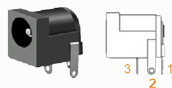
    
+---+--------+---------------------------+---+--------+--------------+
| P | Signal | Description               | P | Signal | Description  |
| i |        |                           | i |        |              |
| n |        |                           | n |        |              |
+---+--------+---------------------------+---+--------+--------------+
| 1 | VDD5V  | Main power supply. DC 5V  | 2 | GND    | Ground       |
|   |        | power in                  |   |        |              |
+---+--------+---------------------------+---+--------+--------------+
| 3 | GND    | Ground                    |   |        |              |
+---+--------+---------------------------+---+--------+--------------+

-  **Lithium battery (J17)**

EM3288 provides an external Li-battery interface. **It is a Reserved
interface that function not supported currently.**

.. image:: image/7-DC-SATA.gif
    :align: center
    
+---+--------+----------------+---+------+---------------------------+
| P | Signal | Description    | P | Si   | Description               |
| i |        |                | i | gnal |                           |
| n |        |                | n |      |                           |
+---+--------+----------------+---+------+---------------------------+
| 1 | GND    | Ground         | 2 | VBAT | Li-Battery                |
+---+--------+----------------+---+------+---------------------------+

2.2 Ethernet (JP1)
^^^^^^^^^^^^^^^^^^^

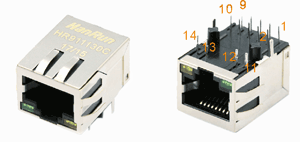
    
RK3288 has integrated Gigabit Ethernet MAC. EM3288 adopts RTL8211E as
the Ethernet chip. RJ45 connector

**Feature**

-  Supports 10/100/1000-Mbps data transfer rates with the RGMII
   interfaces

-  Supports both full-duplex and half-duplex operation

-  Supports IEEE 802.1Q VLAN tag detection for reception frames

+---+---------+--------------------+---+--------+--------------------+
| P | Signal  | Description        | P | Signal | Description        |
| i |         |                    | i |        |                    |
| n |         |                    | n |        |                    |
+---+---------+--------------------+---+--------+--------------------+
| 1 | COM     | Common             | 2 | MDI0P  | Bi-directional     |
|   |         |                    |   |        | transmit/receive   |
|   |         |                    |   |        | pair 0             |
+---+---------+--------------------+---+--------+--------------------+
| 3 | MDI0N   | Bi-directional     | 4 | MDI1P  | Bi-directional     |
|   |         | transmit/receive   |   |        | transmit/receive   |
|   |         | pair 0             |   |        | pair 1             |
+---+---------+--------------------+---+--------+--------------------+
| 5 | MDI2P   | Bi-directional     | 6 | MDI2N  | Bi-directional     |
|   |         | transmit/receive   |   |        | transmit/receive   |
|   |         | pair2              |   |        | pair2              |
+---+---------+--------------------+---+--------+--------------------+
| 7 | MDI1N   | Bi-directional     | 8 | MDI3P  | Bi-directional     |
|   |         | transmit/receive   |   |        | transmit/receive   |
|   |         | pair 1             |   |        | pair 3             |
+---+---------+--------------------+---+--------+--------------------+
| 9 | MDI3N   | Bi-directional     | 1 | GND    | Ground             |
|   |         | transmit/receive   | 0 |        |                    |
|   |         | pair 3             |   |        |                    |
+---+---------+--------------------+---+--------+--------------------+
| 1 | VCC_LAN | 3.3V               | 1 | LINK   | Detect link        |
| 1 |         |                    | 2 |        |                    |
+---+---------+--------------------+---+--------+--------------------+
| 1 | GND     | Ground             | 1 | SPEED  | Detect speed       |
| 3 |         |                    | 4 |        |                    |
+---+---------+--------------------+---+--------+--------------------+
| 1 | GND     | Ground             | 1 | GND    | Ground             |
| 5 |         |                    | 6 |        |                    |
+---+---------+--------------------+---+--------+--------------------+

2.3 USB HOST (P2, P3)
^^^^^^^^^^^^^^^^^^^

EM3288 provides 3x USB2.0 Host. One is a single USB (P2), and the other
is a double-USB (P3). The 3-ch USB HOST interfaces are extended by
AU6256 which is a fully compliant with the USB 2.0 hub specification and
is designed to work with USB host as a high-speed hub.

**Feature**

-  Compatible with USB Host2.0 specification

-  Supports high-speed (480Mbps), full-speed (12Mbps) and low-speed
   (1.5Mbps) mode

-  Supports automatic switching between bus- and self-powered modes

-  Provides 16 host mode channels

-  Support periodic out channel in host mode

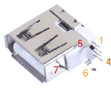
    
+---+---------+--------------------+---+--------+--------------------+
| Single Host (P2)                                                   |
+---+---------+--------------------+---+--------+--------------------+
| P | Signal  | Description        | P | Signal | Description        |
| i |         |                    | i |        |                    |
| n |         |                    | n |        |                    |
+---+---------+--------------------+---+--------+--------------------+
| 1 | VCC_5V  | USB Power. DC 5V   | 2 | U      | USB data-          |
|   |         |                    |   | SB_DM2 |                    |
+---+---------+--------------------+---+--------+--------------------+
| 3 | USB_DP2 | USB Data+          | 4 | GND    | Ground             |
+---+---------+--------------------+---+--------+--------------------+
| 5 | GND     | Ground             | 6 | GND    | Ground             |
+---+---------+--------------------+---+--------+--------------------+
| 7 | GND     | Ground             |   |        |                    |
+---+---------+--------------------+---+--------+--------------------+

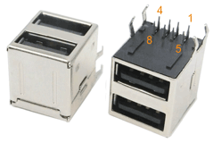
    
+---+-------------+---------------+---+--------------+--------------+
| Dual-USB Host (P3)                                                |
+---+-------------+---------------+---+--------------+--------------+
| P | Signal      | Description   | P | Signal       | Description  |
| i |             |               | i |              |              |
| n |             |               | n |              |              |
+---+-------------+---------------+---+--------------+--------------+
| 1 | VCC_USB     | USB Power. DC | 2 | USB_DM3      | USB data-    |
|   |             | 5V            |   |              |              |
+---+-------------+---------------+---+--------------+--------------+
| 3 | USB_DP3     | USB Data+     | 4 | GND          | Ground       |
+---+-------------+---------------+---+--------------+--------------+
| 5 | VCC_USB     | USB Power. DC | 6 | USB_DM4      | USB data-    |
|   |             | 5V            |   |              |              |
+---+-------------+---------------+---+--------------+--------------+
| 7 | USB_DP4     | USB Data+     | 8 | GND          | Ground       |
+---+-------------+---------------+---+--------------+--------------+
| 9 | GND         | Ground        | 1 | GND          | Ground       |
|   |             |               | 0 |              |              |
+---+-------------+---------------+---+--------------+--------------+
| 1 | GND         | Ground        | 1 | GND          | Ground       |
| 1 |             |               | 2 |              |              |
+---+-------------+---------------+---+--------------+--------------+

2.4 USB OTG (J8)
^^^^^^^^^^^^^^^^^^^

EM3288 OTG is a Micro USB2.0 port, it is used to download image and ADB
transfer file.

**Feature**

-  Compatible with USB OTG2.0 specification

-  Supports USB 2.0 High Speed (480Mbps), Full Speed (12Mbps) and Low
   Speed (1.5Mbps) operation in host mode

-  Supports USB 2.0 High Speed (480 Mbps) and Full Speed (12 Mbps)
   operation in peripheral mode.

-  Hardware support for OTG signaling, session request protocol, and
   host negotiation protocol.

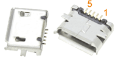
    
+---+-------------+---------------+---+--------------+--------------+
| P | Signal      | Description   | P | Signal       | Description  |
| i |             |               | i |              |              |
| n |             |               | n |              |              |
+---+-------------+---------------+---+--------------+--------------+
| 1 | OTG_DET     | OTG detection | 2 | OTG_DM       | OTG data -   |
+---+-------------+---------------+---+--------------+--------------+
| 3 | OTG_DP      | OTG data+     | 4 | OTG_ID       | OTG ID       |
|   |             |               |   |              | indicator    |
+---+-------------+---------------+---+--------------+--------------+
| 5 | GND         | Ground        |   |              |              |
+---+-------------+---------------+---+--------------+--------------+

2.5 Micro SD (J1)
^^^^^^^^^^^^^^^^^^^

The Micro SD card is used as an external storage device. The MMC
controller interface supports up to 4-bit transfer modes. MMC is always
accessible through the carrier board interface. It does not support
hot-plug.

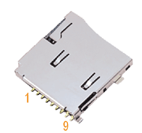
    
+---+------------+-----------------+---+--------------+--------------+
| P | Signal     | Description     | P | Signal       | Description  |
| i |            |                 | i |              |              |
| n |            |                 | n |              |              |
+---+------------+-----------------+---+--------------+--------------+
| 1 | SDMMC_D2   | SD/MMC data2    | 2 | SDMMC_D3     | SD/MMC data3 |
+---+------------+-----------------+---+--------------+--------------+
| 3 | SDMMC_CMD  | SD/MMC command  | 4 | VCCIO_SD     | 3.3V         |
|   |            | signal          |   |              |              |
+---+------------+-----------------+---+--------------+--------------+
| 5 | SDMMC_CLK  | SD/MMC clock    | 6 | GND          | Ground       |
+---+------------+-----------------+---+--------------+--------------+
| 7 | SDMMC_D0   | SD/MMC data0    | 8 | SDMMC_D1     | SD/MMC data1 |
+---+------------+-----------------+---+--------------+--------------+
| 9 | SDMMC_DET  | SD/MMC detect   |   |              |              |
|   |            | signal          |   |              |              |
+---+------------+-----------------+---+--------------+--------------+

2.6 HDMI (PH1)
^^^^^^^^^^^^^^^^^^^

EM3288 HDMI2.0 supports maximum 4Kx2K display, and it also enables
HDMI/LCD audio and video synchronization output. The HDMI interface is
the regular 19pins HDMI type A, with width 13.9mm and thickness 4.45mm.

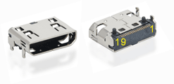
    
+---+-------------+---------------+---+--------------+--------------+
| P | Signal      | Description   | P | Signal       | Description  |
| i |             |               | i |              |              |
| n |             |               | n |              |              |
+---+-------------+---------------+---+--------------+--------------+
| 1 | TX_2+       | HDMI data 2   | 2 | GND          | Ground       |
|   |             | pair          |   |              |              |
+---+-------------+---------------+---+--------------+--------------+
| 3 | TX_2-       |               | 4 | TX_1+        | HDMI data 1  |
|   |             |               |   |              | pair         |
+---+-------------+---------------+---+--------------+--------------+
| 5 | GND         | Ground        | 6 | TX_1-        |              |
+---+-------------+---------------+---+--------------+--------------+
| 7 | TX_0+       | HDMI data 0   | 8 | GND          | Ground       |
|   |             | pair          |   |              |              |
+---+-------------+---------------+---+--------------+--------------+
| 9 | TX_0-       |               | 1 | TX_C+        | HDMI clock   |
|   |             |               | 0 |              | pair         |
+---+-------------+---------------+---+--------------+--------------+
| 1 | GND         | Ground        | 1 | TX_C-        |              |
| 1 |             |               | 2 |              |              |
+---+-------------+---------------+---+--------------+--------------+
| 1 | HDMI_CEC    | Consumer      | 1 | NC           | Not connect  |
| 3 |             | electronics   | 4 |              |              |
|   |             | control       |   |              |              |
+---+-------------+---------------+---+--------------+--------------+
| 1 | HDMI_SCL    | HDMI serial   | 1 | HDMI_SDA     | HDMI serial  |
| 5 |             | clock         | 6 |              | data         |
+---+-------------+---------------+---+--------------+--------------+
| 1 | GND         | Ground        | 1 | HDMI_VCC     | 5V           |
| 7 |             |               | 8 |              |              |
+---+-------------+---------------+---+--------------+--------------+
| 1 | HDMI_HPD    | Hot Plug      | 2 | GND          | Ground       |
| 9 |             | Detect        | 0 |              |              |
+---+-------------+---------------+---+--------------+--------------+
| 2 | GND         | Ground        | 2 | GND          | Ground       |
| 1 |             |               | 2 |              |              |
+---+-------------+---------------+---+--------------+--------------+
| 2 | GND         | Ground        |   |              |              |
| 3 |             |               |   |              |              |
+---+-------------+---------------+---+--------------+--------------+

2.7 Audio I/O (J6, J7, MIC1)
^^^^^^^^^^^^^^^^^^^^^^^^^^^^^^^^^^^^^^

The EM3288 adopts audio codec ES8388, provides stereo audio output
(Green, 3.5mm audio jack) and line in (Pink, 3.5mm audio jack).

**Features**

-  Low power

-  Integrated ADC and DAC

-  IIS transfer audio data

-  Stereo output, support recording

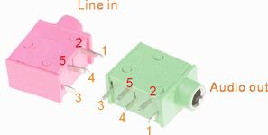
    
+---+------+----------------------+---+------+----------------------+
| Line in (J6)                                                      |
+---+------+----------------------+---+------+----------------------+
| P | Si   | Description          | P | Si   | Description          |
| i | gnal |                      | i | gnal |                      |
| n |      |                      | n |      |                      |
+---+------+----------------------+---+------+----------------------+
| 1 | GND  | Ground               | 2 | RIN2 | Right Channel input  |
+---+------+----------------------+---+------+----------------------+
| 3 | RIN2 | Right Channel input  | 4 | LIN2 | Left Channel input   |
+---+------+----------------------+---+------+----------------------+
| 5 | LIN2 | Left Channel input   |   |      |                      |
+---+------+----------------------+---+------+----------------------+
| Audio out (J7)                                                    |
+---+------+----------------------+---+------+----------------------+
| P | Si   | Description          | P | Si   | Description          |
| i | gnal |                      | i | gnal |                      |
| n |      |                      | n |      |                      |
+---+------+----------------------+---+------+----------------------+
| 1 | GND  | Ground               | 2 | H    | Right Channel        |
|   |      |                      |   | P_RO | Headphone Output     |
+---+------+----------------------+---+------+----------------------+
| 3 | A    | Right Channel        | 4 | A    | Left Channel         |
|   | ROUT | Headphone Output     |   | LOUT | Headphone Output     |
+---+------+----------------------+---+------+----------------------+
| 5 | H    | Left Channel         |   |      |                      |
|   | P_LO | Headphone Output     |   |      |                      |
+---+------+----------------------+---+------+----------------------+

The Microphone MIC1 model is WM_64BC MIC/F6/DIP. It is used for
recording.

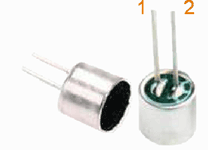
    
+---+-------------+---------------+---+--------------+--------------+
| MIC1                                                              |
+---+-------------+---------------+---+--------------+--------------+
| P | Signal      | Description   | P | Signal       | Description  |
| i |             |               | i |              |              |
| n |             |               | n |              |              |
+---+-------------+---------------+---+--------------+--------------+
| 1 | MIC1P       | Command       | 2 | MIC1N        | Ground       |
|   |             | signal        |   |              |              |
+---+-------------+---------------+---+--------------+--------------+

.. Note::

   1. The audio default output from HDMI. No sound in headphone if not remove HDMI.
   2. Default recording via MIC1 if the Line_in jack is not plugged in.

2.8 VGA (J20)
^^^^^^^^^^^^^^^^^^^

EM3288 adopts standard 15-pin female VGA connector, and SDA7123
3-Channel 10 Digit Video D/A converter.

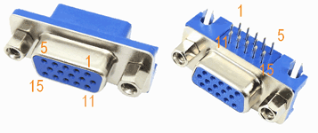
    
+---+------------+----------------+---+--------------+--------------+
| P | Signal     | Description    | P | Signal       | Description  |
| i |            |                | i |              |              |
| n |            |                | n |              |              |
+---+------------+----------------+---+--------------+--------------+
| 1 | IOR        | Video red      | 2 | IOG          | Video green  |
+---+------------+----------------+---+--------------+--------------+
| 3 | IOB        | Video blue     | 4 | NC           | Not connect  |
+---+------------+----------------+---+--------------+--------------+
| 5 | GND        | Ground         | 6 | GND          | Ground       |
+---+------------+----------------+---+--------------+--------------+
| 7 | GND        | Ground         | 8 | GND          | Ground       |
+---+------------+----------------+---+--------------+--------------+
| 9 | VCC5V      | DC 5V          | 1 | GND          | Ground       |
|   |            |                | 0 |              |              |
+---+------------+----------------+---+--------------+--------------+
| 1 | NC         | Not connect    | 1 | VGA_OUT_SDA  | Serial Data  |
| 1 |            |                | 2 |              |              |
+---+------------+----------------+---+--------------+--------------+
| 1 | LCD_HSYNC  | LCD Horizontal | 1 | LCD_VSYNC    | LCD Vertical |
| 3 |            | Sync           | 4 |              | Sync         |
+---+------------+----------------+---+--------------+--------------+
| 1 | GND        | Ground         |   |              |              |
| 5 |            |                |   |              |              |
+---+------------+----------------+---+--------------+--------------+

2.9 LVDS (CON3)
^^^^^^^^^^^^^^^^^^^

EM3288 supports 10.1-inch HD capacitive LCD, up to 1280 x 800
resolution.

**Feature**

-  Comply with the TIA/EIA-644-A LVDS standard

-  Combine LVTTL IO, support LVDS/LVTTL data output

-  Support reference clock frequency range from 10MHz to 148.5MHz

-  Support LVDS RGB 30/24/18bits color data transfer

-  Support VESA/JEIDA LVDS data format transfer

-  Support MSB mode and LSB mode data transfer

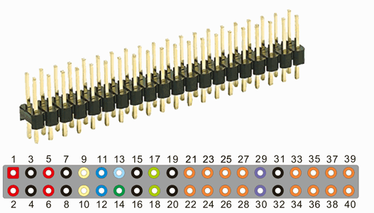
    
+---+-----------+---+------------+---+------------+---+-------------+
| P | Signal    | P | Signal     | P | Signal     | P | Signal      |
| i |           | i |            | i |            | i |             |
| n |           | n |            | n |            | n |             |
+---+-----------+---+------------+---+------------+---+-------------+
| 1 | VCC5V     | 2 | VCC5V      | 3 | GND        | 4 | GND         |
+---+-----------+---+------------+---+------------+---+-------------+
| 5 | VCC_IO    | 6 | VCC_IO     | 7 | GND        | 8 | GND         |
+---+-----------+---+------------+---+------------+---+-------------+
| 9 | I2C4_SCL  | 1 | I2C4_SDA   | 1 | TOUCH_RST  | 1 | TOUCH_INT   |
|   |           | 0 |            | 1 |            | 2 |             |
+---+-----------+---+------------+---+------------+---+-------------+
| 1 | LVDS_EN   | 1 | LVDS_PWM   | 1 | GND        | 1 | GND         |
| 3 |           | 4 |            | 5 |            | 6 |             |
+---+-----------+---+------------+---+------------+---+-------------+
| 1 | LCK1P     | 1 | LCK1N      | 1 | GND        | 2 | GND         |
| 7 |           | 8 |            | 9 |            | 0 |             |
+---+-----------+---+------------+---+------------+---+-------------+
| 2 | LD8P      | 2 | LD8N       | 2 | LD7P       | 2 | LD7N        |
| 1 |           | 2 |            | 3 |            | 4 |             |
+---+-----------+---+------------+---+------------+---+-------------+
| 2 | LD6P      | 2 | LD6N       | 2 | LD5P       | 2 | LD5N        |
| 5 |           | 6 |            | 7 |            | 8 |             |
+---+-----------+---+------------+---+------------+---+-------------+
| 2 | LCK0P     | 3 | LCK0N      | 3 | GND        | 3 | GND         |
| 9 |           | 0 |            | 1 |            | 2 |             |
+---+-----------+---+------------+---+------------+---+-------------+
| 3 | LD3P      | 3 | LD3N       | 3 | LD2P       | 3 | LD2N        |
| 3 |           | 4 |            | 5 |            | 6 |             |
+---+-----------+---+------------+---+------------+---+-------------+
| 3 | LD1P      | 3 | LD1N       | 3 | LD0P       | 4 | LD0N        |
| 7 |           | 8 |            | 9 |            | 0 |             |
+---+-----------+---+------------+---+------------+---+-------------+

2.10 TTL LCD (J21)
^^^^^^^^^^^^^^^^^^^

J21 is a 40-pin FPC connector for TTL LCD.

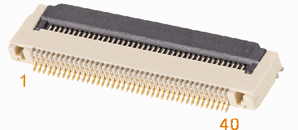
    
+---+-----------+---+------------+---+------------+---+-------------+
| P | Signal    | P | Signal     | P | Signal     | P | Signal      |
| i |           | i |            | i |            | i |             |
| n |           | n |            | n |            | n |             |
+---+-----------+---+------------+---+------------+---+-------------+
| 1 | VCC5V     | 2 | VCC5V      | 3 | L          | 4 | LCD_D1_LD0N |
|   |           |   |            |   | CD_D0_LD0P |   |             |
+---+-----------+---+------------+---+------------+---+-------------+
| 5 | LC        | 6 | CD_D3_LD1N | 7 | L          | 8 | LCD_D5_LD2N |
|   | D_D2_LD1P |   |            |   | CD_D4_LD2P |   |             |
+---+-----------+---+------------+---+------------+---+-------------+
| 9 | LC        | 1 | L          | 1 | GND        | 1 | LCD_D8_LD4P |
|   | D_D6_LD3P | 0 | CD_D7_LD3N | 1 |            | 2 |             |
+---+-----------+---+------------+---+------------+---+-------------+
| 1 | LC        | 1 | LCD        | 1 | LCD        | 1 | L           |
| 3 | D_D9_LD4N | 4 | _D10_LCK0P | 5 | _D11_LCK0N | 6 | CD_D12_LD5P |
+---+-----------+---+------------+---+------------+---+-------------+
| 1 | LCD       | 1 | LC         | 1 | LC         | 2 | GND         |
| 7 | _D13_LD5N | 8 | D_D14_LD6P | 9 | D_D15_LD6N | 0 |             |
+---+-----------+---+------------+---+------------+---+-------------+
| 2 | LCD       | 2 | LC         | 2 | LC         | 2 | L           |
| 1 | _D16_LD7P | 2 | D_D17_LD7N | 3 | D_D18_LD8P | 4 | CD_D19_LD8N |
+---+-----------+---+------------+---+------------+---+-------------+
| 2 | LCD       | 2 | LC         | 2 | LCD        | 2 | LC          |
| 5 | _D20_LD9P | 6 | D_D21_LD9N | 7 | _D22_LCK1P | 8 | D_D23_LCK1N |
+---+-----------+---+------------+---+------------+---+-------------+
| 2 | GND       | 3 | LVDS_PWM   | 3 | GND        | 3 | GND         |
| 9 |           | 0 |            | 1 |            | 2 |             |
+---+-----------+---+------------+---+------------+---+-------------+
| 3 | LCD_DEN   | 3 | LCD_VSYNC  | 3 | LCD_HSYNC  | 3 | LCD_CLK     |
| 3 |           | 4 |            | 5 |            | 6 |             |
+---+-----------+---+------------+---+------------+---+-------------+
| 3 | TSXM      | 3 | TSXP       | 3 | TSYM       | 4 | TSYP        |
| 7 |           | 8 |            | 9 |            | 0 |             |
+---+-----------+---+------------+---+------------+---+-------------+

2.11 MIPI (CON5)
^^^^^^^^^^^^^^^^^^^

EM3288 supports MIPI Camera.

**Features**

-  Embedded 3 MIPI PHY, MIPI 0 only for TX, MIPI 1 for TX and RX, MIPI 2
   only for RX

-  Support 4 data lane, providing up to 6Gbps data rate

-  Support 1080p@60fps output

-  Lane operation ranging from 80 Mbps to 1.5Gbps in forward direction.

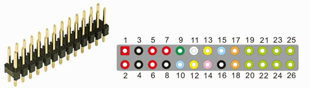
    
+---+-----------+------------------+---+-----------+-----------------+
| P | Signal    | Description      | P | Signal    | Description     |
| i |           |                  | i |           |                 |
| n |           |                  | n |           |                 |
+---+-----------+------------------+---+-----------+-----------------+
| 1 | VCC5V     | DC 5V            | 2 | VCC5V     | DC 5V           |
+---+-----------+------------------+---+-----------+-----------------+
| 3 | GND       | Ground           | 4 | GND       | Ground          |
+---+-----------+------------------+---+-----------+-----------------+
| 5 | VCC_IO    | DC 3.3V          | 6 | VCC_IO    | DC 3.3V         |
+---+-----------+------------------+---+-----------+-----------------+
| 7 | VCCA_18   | DC 1.8V          | 8 | GND       | Ground          |
+---+-----------+------------------+---+-----------+-----------------+
| 9 | LCD1_BL   | Backlight        | 1 | L         | Backlight       |
|   |           |                  | 0 | CD1_BL_EN | enable          |
+---+-----------+------------------+---+-----------+-----------------+
| 1 | C         | Camera clock     | 1 | I2C3_SCL  | I2C clock line  |
| 1 | IF_CLKOUT |                  | 2 |           |                 |
+---+-----------+------------------+---+-----------+-----------------+
| 1 | I2C3_SDA  | I2c date line    | 1 | TOUCH_RST | Touch screen    |
| 3 |           |                  | 4 |           | reset           |
+---+-----------+------------------+---+-----------+-----------------+
| 1 | TOUCH_INT | Touch screen int | 1 | GND       | Ground          |
| 5 |           |                  | 6 |           |                 |
+---+-----------+------------------+---+-----------+-----------------+
| 1 | CLKN      | MIPI clock -     | 1 | CLKP      | MIPI clock +    |
| 7 |           |                  | 8 |           |                 |
+---+-----------+------------------+---+-----------+-----------------+
| 1 | D0N       | Negative         | 2 | D0P       | Positive        |
| 9 |           | Transmission     | 0 |           | Transmission    |
|   |           | Data of Pixel0   |   |           | Data of Pixel0  |
+---+-----------+------------------+---+-----------+-----------------+
| 2 | D1N       | Negative         | 2 | D1P       | Positive        |
| 1 |           | Transmission     | 2 |           | Transmission    |
|   |           | Data of Pixel1   |   |           | Data of Pixel1  |
+---+-----------+------------------+---+-----------+-----------------+
| 2 | D2N       | Negative         | 2 | D2P       | Positive        |
| 3 |           | Transmission     | 4 |           | Transmission    |
|   |           | Data of Pixel2   |   |           | Data of Pixel2  |
+---+-----------+------------------+---+-----------+-----------------+
| 2 | D3N       | Negative         | 2 | D3P       | Positive        |
| 5 |           | Transmission     | 6 |           | Transmission    |
|   |           | Data of Pixel3   |   |           | Data of Pixel3  |
+---+-----------+------------------+---+-----------+-----------------+

2.12 GPS (MU4)
^^^^^^^^^^^^^^^^^^^

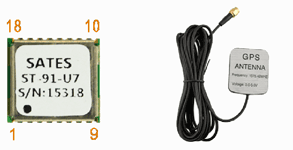
    
The GPS module (Model: ST-91-U7) uses ublox 7 chipset which is high
performance u-blox 7 multi-GNSS (GPS, GLONASS, QZSS, SBAS – Galileo and
Compass ready) position engine delivers exceptional sensitivity and
acquisition times.

**Features**

-  Ublox 7 high performance and low power consumption GPS Chipset

-  Very high sensitivity (Tracking Sensitivity: -162dBm)

-  Extremely fast TTFF (Time to First Fix) at low signal level

-  Two serial port: UART, I2C

-  Built-in LNA

-  A-GPS Support

-  Exceptional jamming immunity

-  Support NMEA 0183 and ublox binary protocol

-  Channels: 56

-  Available Baud: 9,600 bps

-  The antenna band is 1575.42MHZ; Voltage: 3.0-5.0V

+---+-------------+---------------+---+--------------+--------------+
| P | Signal      | Description   | P | Signal       | Description  |
| i |             |               | i |              |              |
| n |             |               | n |              |              |
+---+-------------+---------------+---+--------------+--------------+
| 1 | GND         | Ground        | 2 | GPS_UART3_RX | UART3        |
|   |             |               |   |              | receive      |
+---+-------------+---------------+---+--------------+--------------+
| 3 | G           | UART3         | 4 | NC           | Not connect  |
|   | PS_UART3_TX | transmit      |   |              |              |
+---+-------------+---------------+---+--------------+--------------+
| 5 | NC          | Not connect   | 6 | VCC_RTC      | Backup       |
|   |             |               |   |              | voltage      |
|   |             |               |   |              | supply       |
+---+-------------+---------------+---+--------------+--------------+
| 7 | GPSVDDIO    | IO Supply     | 8 | VDD_GPS      | Supply       |
|   |             | Voltage       |   |              | voltage      |
+---+-------------+---------------+---+--------------+--------------+
| 9 | GPSRST      | Reset         | 1 | GND          | Ground       |
|   |             |               | 0 |              |              |
+---+-------------+---------------+---+--------------+--------------+
| 1 | GPS_RFIN    | GPS signal    | 1 | GND          | Ground       |
| 1 |             | input         | 2 |              |              |
+---+-------------+---------------+---+--------------+--------------+
| 1 | NC          | Not connect   | 1 | RFVCC        | Output       |
| 3 |             |               | 4 |              | Voltage RF   |
|   |             |               |   |              | section      |
+---+-------------+---------------+---+--------------+--------------+
| 1 | NC          | Not connect   | 1 | NC           | Not connect  |
| 5 |             |               | 6 |              |              |
+---+-------------+---------------+---+--------------+--------------+
| 1 | NC          | Not connect   | 1 | NC           | Not connect  |
| 7 |             |               | 8 |              |              |
+---+-------------+---------------+---+--------------+--------------+

2.13 WiFi&Bluetooth (U11)
^^^^^^^^^^^^^^^^^^^^^^^^^^^^^^^^^^^^^^

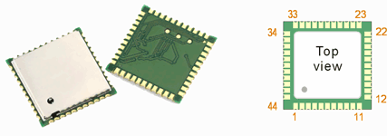
    
AP6236 is a low-power consumption module which has incorporated Wi-Fi
and Bluetooth into one chip. The module complies with IEEE 802.11 b/g/n
standard and it could achieve up to a speed of 72.2Mbps with single
stream in 802.11n draft, 54Mbps as specified in 802.11g, or 11Mbps for
802.11b to connect to the wireless LAN.

Features

-  802.11b/g/n single-band radio

-  Bluetooth V4.0(HS) with integrated Class 1.5 PA and Low Energy (BLE)
   support

-  Concurrent Bluetooth, WLAN operation

-  Simultaneous BT/WLAN receive with single antenna

-  WLAN host interface options:

- SDIO v2.0 — up to 50 MHz clock rate

-  BT host digital interface:

- UART (up to 4 Mbps)

-  IEEE Co-existence technologies are integrated die solution

-  ECI — enhanced coexistence support, ability to coordinate BT SCO
   transmissions around WLAN receives

+---+--------------+----------------+---+------------+---------------+
| P | Signal       | Description    | P | Signal     | Description   |
| i |              |                | i |            |               |
| n |              |                | n |            |               |
+===+==============+================+===+============+===============+
| 1 | GND          | Ground         | 2 | WL_BT_ANT  | RF I/O        |
+---+--------------+----------------+---+------------+---------------+
| 3 | GND          | Ground         | 4 | NC         | Not connect   |
+---+--------------+----------------+---+------------+---------------+
| 5 | NC           | Not connect    | 6 | BT_WAKE    | HOST wake-up  |
|   |              |                |   |            | Bluetooth     |
|   |              |                |   |            | device        |
+---+--------------+----------------+---+------------+---------------+
| 7 | BT_HOST_WAKE | Bluetooth      | 8 | NC         | Not connect   |
|   |              | device to      |   |            |               |
|   |              | wake-up HOST   |   |            |               |
+---+--------------+----------------+---+------------+---------------+
| 9 | VBAT_WL      | Main power     | 1 | XTAL_IN    | Crystal input |
|   |              | voltage source | 0 |            |               |
|   |              | input          |   |            |               |
+---+--------------+----------------+---+------------+---------------+
| 1 | XTAL_OUT     | Crystal output | 1 | W          | Internal      |
| 1 |              |                | 2 | IFI_REG_ON | regulators    |
|   |              |                |   |            | power enable  |
|   |              |                |   |            | / disable     |
+---+--------------+----------------+---+------------+---------------+
| 1 | WI           | External       | 1 | WIFI_D2    | WiFi data     |
| 3 | FI_HOST_WAKE | Interrupt      | 4 |            |               |
|   |              | Input / Keypad |   |            |               |
|   |              | input          |   |            |               |
+---+--------------+----------------+---+------------+---------------+
| 1 | WIFI_D3      | WiFi data      | 1 | WIFI_CMD   | WiFi command  |
| 5 |              |                | 6 |            |               |
+---+--------------+----------------+---+------------+---------------+
| 1 | WIFI_CLK     | WiFi clock     | 1 | WIFI_D0    | WiFi data     |
| 7 |              |                | 8 |            |               |
+---+--------------+----------------+---+------------+---------------+
| 1 | WIFI_D1      | WiFi data      | 2 | GND        | Ground        |
| 9 |              |                | 0 |            |               |
+---+--------------+----------------+---+------------+---------------+
| 2 | VIN_LDO_OUT  | Internal Buck  | 2 | VCCIO_WL   | I/O Voltage   |
| 1 |              | voltage        | 2 |            | supply input  |
|   |              | generation pin |   |            |               |
+---+--------------+----------------+---+------------+---------------+
| 2 | VIN_LDO      | Internal Buck  | 2 | LPO        | External Low  |
| 3 |              | voltage        | 4 |            | Power Clock   |
|   |              | generation pin |   |            | input         |
|   |              |                |   |            | (32.768KHz)   |
+---+--------------+----------------+---+------------+---------------+
| 2 | NC           | Not connect    | 2 | NC         | Not connect   |
| 5 |              |                | 6 |            |               |
+---+--------------+----------------+---+------------+---------------+
| 2 | NC           | Not connect    | 2 | NC         | Not connect   |
| 7 |              |                | 8 |            |               |
+---+--------------+----------------+---+------------+---------------+
| 2 | NC           | Not connect    | 3 | NC         | Not connect   |
| 9 |              |                | 0 |            |               |
+---+--------------+----------------+---+------------+---------------+
| 3 | GND          | Ground         | 3 | NC         | Not connect   |
| 1 |              |                | 2 |            |               |
+---+--------------+----------------+---+------------+---------------+
| 3 | GND          | Ground         | 3 | BT_RST     | Bluetooth     |
| 3 |              |                | 4 |            | reset         |
+---+--------------+----------------+---+------------+---------------+
| 3 | NC           | Not connect    | 3 | GND        | Ground        |
| 5 |              |                | 6 |            |               |
+---+--------------+----------------+---+------------+---------------+
| 3 | NC           | Not connect    | 3 | NC         | Not connect   |
| 7 |              |                | 8 |            |               |
+---+--------------+----------------+---+------------+---------------+
| 3 | NC           | Not connect    | 4 | NC         | Not connect   |
| 9 |              |                | 0 |            |               |
+---+--------------+----------------+---+------------+---------------+
| 4 | UART0_CTS    | Bluetooth UART | 4 | UART0_RX   | Bluetooth     |
| 1 |              | interface      | 2 |            | UART          |
|   |              |                |   |            | interface     |
+---+--------------+----------------+---+------------+---------------+
| 4 | UART0_TX     | Bluetooth UART | 4 | UART0_RTS  | Bluetooth     |
| 3 |              | interface      | 4 |            | UART          |
|   |              |                |   |            | interface     |
+---+--------------+----------------+---+------------+---------------+

2.14 Debug UART (J10)
^^^^^^^^^^^^^^^^^^^

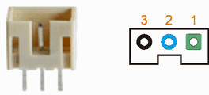
    
The debug serial port (UART2) is used to connect PC and board with the
USB-to-serial cable (CP2102).

+---+-------------+---------------+---+--------------+--------------+
| P | Signal      | Description   | P | Signal       | Description  |
| i |             |               | i |              |              |
| n |             |               | n |              |              |
+---+-------------+---------------+---+--------------+--------------+
| 1 | UART2_RX    | UART2 receive | 2 | UART2_TX     | UART2        |
|   |             |               |   |              | transmit     |
+---+-------------+---------------+---+--------------+--------------+
| 3 | GND         | Ground        |   |              |              |
+---+-------------+---------------+---+--------------+--------------+

2.15 GPIO (CON4)
^^^^^^^^^^^^^^^^^^^

The GPIO is a 40-pin header connector. The pins can be defined as data
input / output.

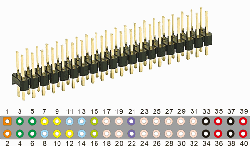
    
+---+-------------+---------------+---+--------------+--------------+
| GPIO (CON4)                                                       |
+---+-------------+---------------+---+--------------+--------------+
| P | Signal      | Description   | P | Signal       | Description  |
| i |             |               | i |              |              |
| n |             |               | n |              |              |
+---+-------------+---------------+---+--------------+--------------+
| 1 | ADC2_IN     | ADC2 input    | 2 | ADC0_IN      | ADC0 input   |
+---+-------------+---------------+---+--------------+--------------+
| 3 | SPI0        | SPI0 clock/   | 4 | SPI0         | SPI0 Chip    |
|   | _CLK/TS0_D4 | TSI data4     |   | _CSn0/TS0_D5 | Select/ TSI  |
|   |             |               |   |              | data5        |
+---+-------------+---------------+---+--------------+--------------+
| 5 | SPI0_UART4  | UART4 receive | 6 | SPI0_UART    | UART4        |
|   | _RXD/TS0_D7 | data/ TSI     |   | 4_TXD/TS0_D6 | transmit     |
|   |             | data7         |   |              | data/ TSI    |
|   |             |               |   |              | data6        |
+---+-------------+---------------+---+--------------+--------------+
| 7 | UART1_      | UART1 clear   | 8 | TS0_SYNC     | TSI          |
|   | CTSn/TS0_D2 | to send/ TSI  |   |              | synchronizer |
|   |             | data2         |   |              | signal       |
+---+-------------+---------------+---+--------------+--------------+
| 9 | UART        | UART1         | 1 | UART1        | UART1        |
|   | 1_RX/TS0_D0 | receive/ TSI  | 0 | _RTSn/TS0_D3 | r            |
|   |             | data0         |   |              | eady-to-send |
|   |             |               |   |              | output/ TSI  |
|   |             |               |   |              | data3        |
+---+-------------+---------------+---+--------------+--------------+
| 1 | TS0_CLK     | TSI reference | 1 | UAR          | UART1        |
| 1 |             | clock         | 2 | T1_TX/TS0_D1 | transmit/    |
|   |             |               |   |              | TSI data1    |
+---+-------------+---------------+---+--------------+--------------+
| 1 | TS0_ERR     | TSI fail      | 1 | TS0_VALID    | TSI valid    |
| 3 |             | signal        | 4 |              | signal       |
+---+-------------+---------------+---+--------------+--------------+
| 1 | I2C3_SCL    | I2C3 serial   | 1 | I2C3_SDA     | I2C3 serial  |
| 5 |             | clock         | 6 |              | data         |
+---+-------------+---------------+---+--------------+--------------+
| 1 | CIF_CLKOUT  | Camera0       | 1 | CIF_CLKIN    | Camera0      |
| 7 |             | interface     | 8 |              | interface    |
|   |             | output work   |   |              | input pixel  |
|   |             | clock         |   |              | clock        |
+---+-------------+---------------+---+--------------+--------------+
| 1 | CIF_HREF    | Camera0       | 2 | CIF_VSYNC    | Camera0      |
| 9 |             | interface     | 0 |              | interface    |
|   |             | horizontal    |   |              | vertical     |
|   |             | sync signal   |   |              | sync signal  |
+---+-------------+---------------+---+--------------+--------------+
| 2 | GPIO1_B7    | GPIO          | 2 | GPIO1_B6     | GPIO         |
| 1 |             |               | 2 |              |              |
+---+-------------+---------------+---+--------------+--------------+
| 2 | CIF_D9      | Camera0       | 2 | CIF_D8       | Camera0      |
| 3 |             | interface     | 4 |              | interface    |
|   |             | input pixel   |   |              | input pixel  |
|   |             | data9         |   |              | data8        |
+---+-------------+---------------+---+--------------+--------------+
| 2 | CIF_D7      | Camera0       | 2 | CIF_D6       | Camera0      |
| 5 |             | interface     | 6 |              | interface    |
|   |             | input pixel   |   |              | input pixel  |
|   |             | data7         |   |              | data6        |
+---+-------------+---------------+---+--------------+--------------+
| 2 | CIF_D5      | Camera0       | 2 | CIF_D4       | Camera0      |
| 7 |             | interface     | 8 |              | interface    |
|   |             | input pixel   |   |              | input pixel  |
|   |             | data5         |   |              | data4        |
+---+-------------+---------------+---+--------------+--------------+
| 2 | CIF_D3      | Camera0       | 3 | CIF_D2       | Camera0      |
| 9 |             | interface     | 0 |              | interface    |
|   |             | input pixel   |   |              | input pixel  |
|   |             | data3         |   |              | data2        |
+---+-------------+---------------+---+--------------+--------------+
| 3 | CIF_D1      | Camera0       | 3 | CIF_D0       | Camera0      |
| 1 |             | interface     | 2 |              | interface    |
|   |             | input pixel   |   |              | input pixel  |
|   |             | data1         |   |              | data0        |
+---+-------------+---------------+---+--------------+--------------+
| 3 | GND         | Ground        | 3 | GND          | Ground       |
| 3 |             |               | 4 |              |              |
+---+-------------+---------------+---+--------------+--------------+
| 3 | VCC_IO      | 3.3V          | 3 | VCC_IO       | 3.3V         |
| 5 |             |               | 6 |              |              |
+---+-------------+---------------+---+--------------+--------------+
| 3 | GND         | Ground        | 3 | GND          | Ground       |
| 7 |             |               | 8 |              |              |
+---+-------------+---------------+---+--------------+--------------+
| 3 | VCC5V       | 5V            | 4 | VCC5V        | 5V           |
| 9 |             |               | 0 |              |              |
+---+-------------+---------------+---+--------------+--------------+

2.15 Control (J2)
^^^^^^^^^^^^^^^^^^^

The Pin6 of J2 is IR_IN. The EM3288 supports IR data receiver. The
signals are transmitted directly to the CPU.

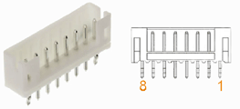

+---+-------------+---------------+---+--------------+--------------+
| P | Signal      | Description   | P | Signal       | Description  |
| i |             |               | i |              |              |
| n |             |               | n |              |              |
+---+-------------+---------------+---+--------------+--------------+
| 1 | VCC_IO      | 3.3V          | 2 | GND          | Ground       |
+---+-------------+---------------+---+--------------+--------------+
| 3 | KEY_IN      | Recover key   | 4 | PWR_KEY      | Power key    |
|   |             | in            |   |              |              |
+---+-------------+---------------+---+--------------+--------------+
| 5 | GND         | Ground        | 6 | IR_IN        | IR in        |
+---+-------------+---------------+---+--------------+--------------+
| 7 | WORK_LED    | Work LED      | 8 | PWR_LED      | Power LED    |
+---+-------------+---------------+---+--------------+--------------+

2.16 Buttons (K1, K2)
^^^^^^^^^^^^^^^^^^^^^^^^

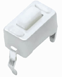

Short press K1 is sleep/wake up and long press is reboot.

The K2 is used for download combined with OTG

+---+---------+-------------------+-----+------------+--------------+
| K | Signal  | Description       | Key | Signal     | Description  |
| e |         |                   |     |            |              |
| y |         |                   |     |            |              |
+---+---------+-------------------+-----+------------+--------------+
| K | PWR-KEY | Short: Sleep/Wake | K2  | RECOVER    | Download     |
| 1 |         | up                |     |            | mode         |
|   |         |                   |     |            |              |
|   |         | Long: Reboot      |     |            |              |
+---+---------+-------------------+-----+------------+--------------+

2.17 4G (CON2)
^^^^^^^^^^^^^^^^^^^

EM3288 adopts the standard PCI Express MiniCard form factor (MiniPCIe)
and provides global network coverage on the connectivity of LTE. It
delivers 50Mbps-up and100Mbps-down data rates on LTE FDD networks and
can also be fully backward compatible with existing UMTS and GSM/GPRS
networks.

**4G (EC20) Technical Specifications**

-  Form Factor: PCI Express Mini Card

-  Size: 51 x 30 x 4.9mm

-  Weight: 9.8g

-  Bandwidth: 1.4/3/5/10/15/20MHz

-  Temperature Range: -40°C ~ +80°C

-  Supply Voltage: 3.0V~3.6V, 3.3V Typical

-  3GPP TS27.007 and Enhanced AT Commands

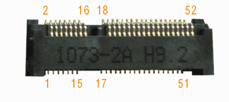

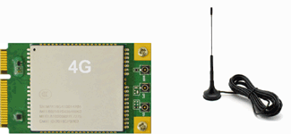

+---+-----------+---+------------+---+------------+---+--------------+
| 4G Connector (CON2)                                                |
+---+-----------+---+------------+---+------------+---+--------------+
| P | Signal    | P | Signal     | P | Signal     | P | Signal       |
| i |           | i |            | i |            | i |              |
| n |           | n |            | n |            | n |              |
+---+-----------+---+------------+---+------------+---+--------------+
| 1 | NC        | 2 | 3GVCC      | 3 | NC         | 4 | GND          |
+---+-----------+---+------------+---+------------+---+--------------+
| 5 | NC        | 6 | NC         | 7 | NC         | 8 | SIM_VCC      |
+---+-----------+---+------------+---+------------+---+--------------+
| 9 | GND       | 1 | SIM_DATA   | 1 | NC         | 1 | SIM_CLK      |
|   |           | 0 |            | 1 |            | 2 |              |
+---+-----------+---+------------+---+------------+---+--------------+
| 1 | NC        | 1 | SIM_RST    | 1 | GND        | 1 | NC           |
| 3 |           | 4 |            | 5 |            | 6 |              |
+---+-----------+---+------------+---+------------+---+--------------+
| 1 | NC        | 1 | GND        | 1 | NC         | 2 | 3GVCC        |
| 7 |           | 8 |            | 9 |            | 0 |              |
+---+-----------+---+------------+---+------------+---+--------------+
| 2 | GND       | 2 | 3G_PWEN    | 2 | NC         | 2 | 3GVCC        |
| 1 |           | 2 |            | 3 |            | 4 |              |
+---+-----------+---+------------+---+------------+---+--------------+
| 2 | NC        | 2 | GND        | 2 | GND        | 2 | NC           |
| 5 |           | 6 |            | 7 |            | 8 |              |
+---+-----------+---+------------+---+------------+---+--------------+
| 2 | GND       | 3 | NC         | 3 | NC         | 3 | NC           |
| 9 |           | 0 |            | 1 |            | 2 |              |
+---+-----------+---+------------+---+------------+---+--------------+
| 3 | NC        | 3 | GND        | 3 | GND        | 3 | USB_DM1      |
| 3 |           | 4 |            | 5 |            | 6 |              |
+---+-----------+---+------------+---+------------+---+--------------+
| 3 | GND       | 3 | USB_DP1    | 3 | 3GVCC      | 4 | GND          |
| 7 |           | 8 |            | 9 |            | 0 |              |
+---+-----------+---+------------+---+------------+---+--------------+
| 4 | 3GVCC     | 4 | LED_WWAN   | 4 | GND        | 4 | NC           |
| 1 |           | 2 |            | 3 |            | 4 |              |
+---+-----------+---+------------+---+------------+---+--------------+
| 4 | NC        | 4 | NC         | 4 | NC         | 4 | NC           |
| 5 |           | 6 |            | 7 |            | 8 |              |
+---+-----------+---+------------+---+------------+---+--------------+
| 4 | NC        | 5 | GND        | 5 | NC         | 5 | LED_RED.     |
| 9 |           | 0 |            | 1 |            | 2 | 3.3V         |
+---+-----------+---+------------+---+------------+---+--------------+

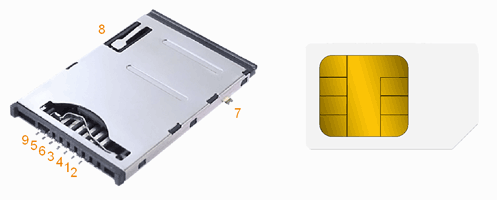

P4 is an auto pop-up SIM card slot which is compatible to the standard
SIM Card and can be used for wireless transmission with a 3G/4G module.

+---+----------+-----------------+---+---------+---------------------+                                
| SIM Card slot (P4)                                                 |
+---+----------+-----------------+---+---------+---------------------+
| P | Signal   | Description     | P | Signal  | Description         |
| i |          |                 | i |         |                     |
| n |          |                 | n |         |                     |
+---+----------+-----------------+---+---------+---------------------+
| 1 | SIM_CLK  | Clock           | 2 | S       | send/receive data   |
|   |          |                 |   | IM_DATA |                     |
+---+----------+-----------------+---+---------+---------------------+
| 3 | SIM_RST  | Reset           | 4 | SIM_VCC | DC power supply     |
+---+----------+-----------------+---+---------+---------------------+
| 5 | SIM_VCC  | DC 5V power     | 6 | GND     | Ground              |
|   |          | supply          |   |         |                     |
+---+----------+-----------------+---+---------+---------------------+
| 7 | GND      | Ground          | 8 | GND     | Ground              |
+---+----------+-----------------+---+---------+---------------------+
| 9 | GND      | Ground          |                                   |
+---+----------+-----------------+---+---------+---------------------+

2.18 SATA & SATA_Power (J14, J18)
^^^^^^^^^^^^^^^^^^^^^^^^^^^^^^^^^^^^^^

On-board 7-pin SATA Interface, equipped with a HS USB to SATA bridge
JM20329. It requires 5V power supply. The SATA only supports mobile hard
disk, not desktop hard disk.

**Features**

-  Compliance with Gen1i/Gen1m of Serial ATA II Electrical Specification
   2.5

-  Support SATA II Asynchronous Signal Recovery (Hot Plug) feature

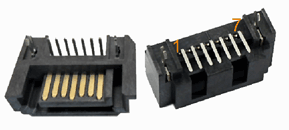

+---+-------------+---------------+---+--------------+--------------+
| SATA Connector (J14)                                              |
+---+-------------+---------------+---+--------------+--------------+
| P | Signal      | Description   | P | Signal       | Description  |
| i |             |               | i |              |              |
| n |             |               | n |              |              |
+---+-------------+---------------+---+--------------+--------------+
| 1 | GND         | Ground        | 2 | SATA_TXP     | Transmit +   |
+---+-------------+---------------+---+--------------+--------------+
| 3 | SATA_TXN    | Transmit -    | 4 | GND          | Ground       |
+---+-------------+---------------+---+--------------+--------------+
| 5 | SATA_RXN    | Receive -     | 6 | SATA_RXP     | Receive +    |
+---+-------------+---------------+---+--------------+--------------+
| 7 | GND         | Ground        |   |              |              |
+---+-------------+---------------+---+--------------+--------------+

.. image:: image/7-DC-SATA.gif
   :align: center

+---+-------------+---------------+---+--------------+--------------+
| SATA Power (J18)                                                  |
+---+-------------+---------------+---+--------------+--------------+
| P | Signal      | Description   | P | Signal       | Description  |
| i |             |               | i |              |              |
| n |             |               | n |              |              |
+---+-------------+---------------+---+--------------+--------------+
| 1 | SATA_5V     | SATA power.   | 2 | GND          | Ground       |
|   |             | DC 5V         |   |              |              |
+---+-------------+---------------+---+--------------+--------------+

2.19 RTC (BT1)
^^^^^^^^^^^^^^^^^^^

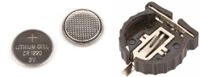

The backup battery (3V) is used to ensure the RTC (frequency 32.768KHz)
is still able to work after power off. Lithium cell model: CR1220.
